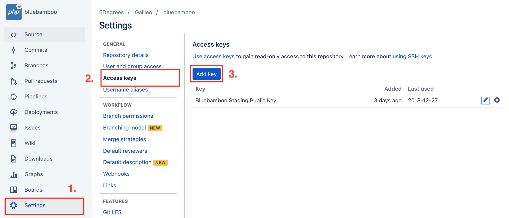
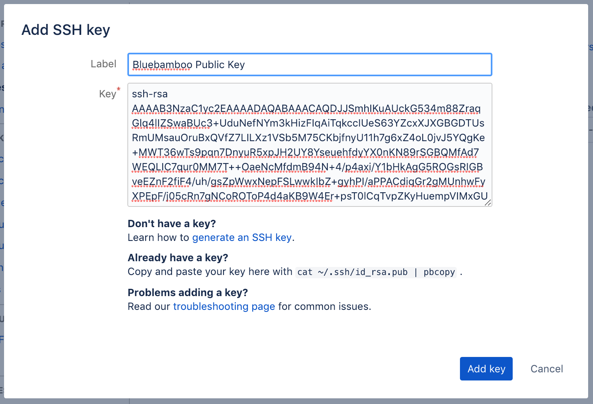
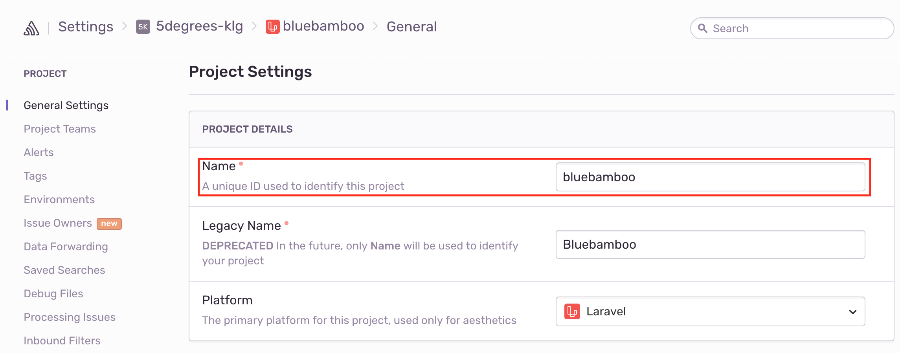
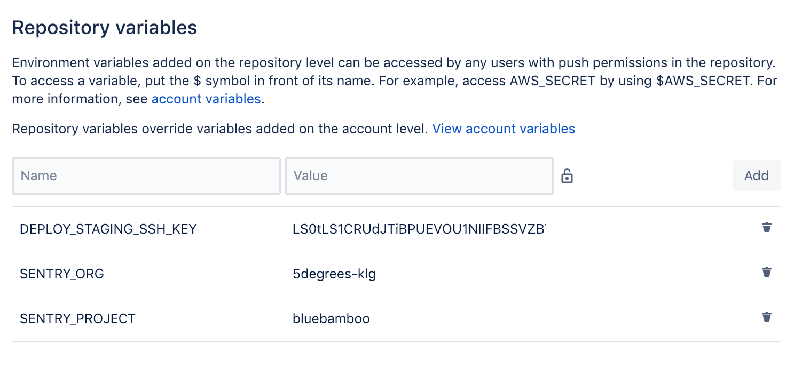
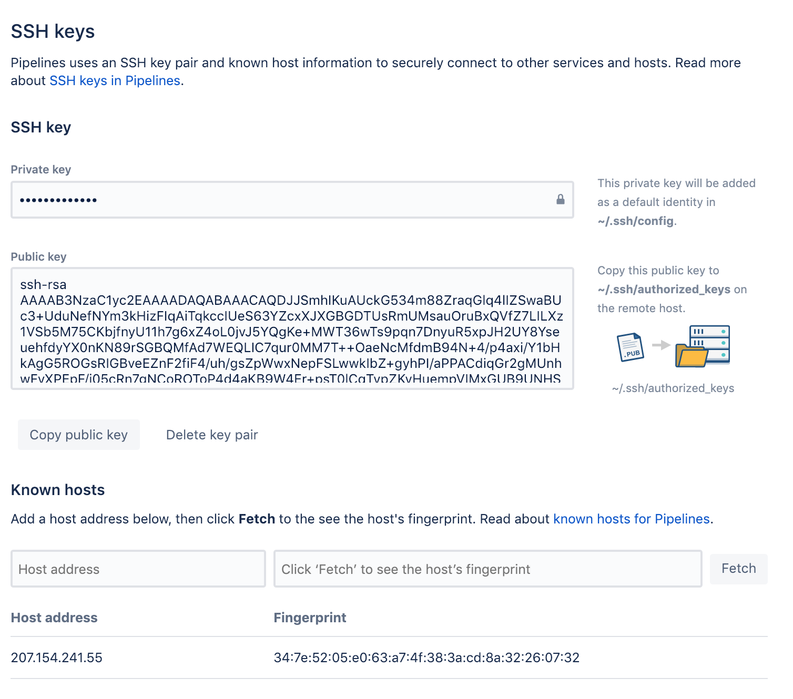
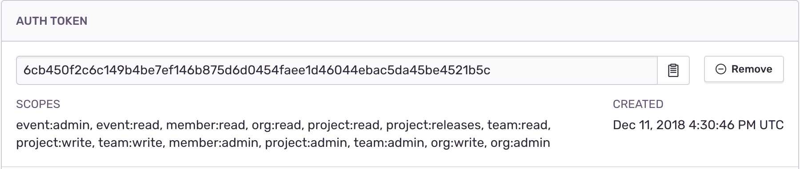

# Introduction

In this article I will explain exactly how to setup a fully automated Continuous Integration / Continuous Delivery pipeline on a Laravel project.

Advantages of this approach include:

* All engineers can deploy anytime, no waiting time
* Automated testing is fully supported and integrated
* Easy-to-use, no remembering of long, complicated commands etc.
* Graphical UI and detailed output about each step and result
* Everything is done automatically, from uploading files to setting file permissions to installing dependencies
* Blue / Green-Style Deployment (means Zero Downtime)
* Feedback sent to Slack
* Sentry Error Logging and Tracing Integration
* Automated generation of Git tags
* Automated updating of [CHANGELOG](CHANGELOG.md)

## What is NOT done automatically (yet)

* Web server configuration (Nginx configuration etc.)
* Creating database, migrations and seeding (intentionally skipped)

## Pre-requisites

Before we get started, make sure you have following things installed on your local machine:

* Git CLI
* PHP

## Setup Guide:

This guide assumes that you already have respective web servers set up and running and you have created a Git repository for your project. It is also assumed that you added [Sentry](https://sentry.io) to your project and configured it correctly.

Please also note that the default file locations and commands shown in this guide generally apply to Unix-style operating systems such as MacOS and Linux. Commands for Windows might differ a little.

### Part 1: Source Code

First, you need to add some folders and files to your project. You can refer to this example project anytime:
[Bluebamboo](https://bitbucket.org/5degrees/bluebamboo).

Let’s get started:

* In your projects root folder, add a `bitbucket-pipelines.yml` file. Copy the content from the `bitbucket-pipelines.yml` of the example project above.
* In the projects root folder, create environment files for each environment you want to deploy to. Usually this will be staging and production (you can copy and rename the `.env.example` which usually already exists in a default Laravel app project):
```
-- .env.staging
-- .env.production
```
Provide all information such as `APP_NAME`, `APP_URL`, `DB_DATABASE`, `DB_USERNAME`, `DB_PASSWORD` etc. Please set `APP_DEBUG` to `false` for `staging` and `production`.
* In your projects root folder, create a `deploy` folder
* Grab all the files from inside this folder from the example repository above and put them into the `deploy` folder you created before. In detail, the files you need are:

```
-- recipes
	-- slack.php
-- changelog.sh
-- deploy.php
-- deploy.sh
-- hosts.yml
-- known_hosts
-- release-notes.sh
```

You don’t need the `ssh_key` and `ssh_key.pub` as we will generate new keys for security reasons for each new project/server.
* Open the `deploy.php` in the `deploy` folder and change following lines:

```php
// Set your applications name
set('application', 'bluebamboo');

// Set your applications repository (make sure to use the `git` version of the URL)
set('repository', 'git@bitbucket.org:5degrees/bluebamboo.git');
```

* Next open the `hosts.yml` file and change following for each environment:

```yml
hostname: bluebamboo.5degrees.ch # <= Put domain or IP address of the web server here
```

* Run following command to create a new SSH key/pair:
```bash
$ ssh-keygen -t rsa -b 4096 -C "dev@5degrees.ch"
```

* When you get asked this question:
```
Enter file in which to save the key (/Users/your-user/.ssh/id_rsa):
```

Provide the path to your projects `deploy` folder. The filename must also be provided but it doesn't matter how you name the files, although usually we name them `ssh_key`. You don't need to set a password for this file. Just lease it empty and hit `Enter`.

```
Enter file in which to save the key (/Users/davidciulla/.ssh/id_rsa): ~/my-project/deploy/ssh_key
```

If you want to have separate SSH keys for each environment, you could repeat the last step and name the keys accordingly to the environment, e.g.:

```
-- staging (filetype is not required)
-- production (filetype is not required)
```

and your public keys will automatically be named like this:

```
-- staging.pub
-- production.pub
```

Now we need to add the generated public key file to the web server. This can be done like this:

```bash
$ ssh-copy-id -i deploy/ssh_key.pub root@server.example.com -f
```

If there is no error message, let's move on.

One last file needs to be created for the automated deployment called `known_hosts`. We can use following command to scan our webservers for public keys and add it to our `known_hosts` file:

```bash
$ ssh-keyscan -t rsa server.example.com > ./deploy/known_hosts
```

* Push your changes and new files to the repository.
```bash
$ git add 'your added files'
$ git commit -m "[modify] add configuration for CI/CD"
$ git push origin 'your-branch-name'
```

This concludes the first part of this guide. Let's move on to the next one.

## Part 2: Repository

* Log in to [Bitbucket](https://bitbucket.org) and go to your projects repository settings.
* Go to `Access keys` menu and click the `Add key` button.



* Name your key appropriately eg. `My Project Public Key`. Anything descriptive enough will be OK.
* Switch back to your terminal and run this command to copy the content of the public key you created earlier:

```bash
$ cat ~/my-project/deploy/ssh_key.pub | pbcopy
```
* Move back to the repository settings and paste the public key content to `Key` textfield.



* Then head to the `Settings` submenu under `Pipelines` on the repositories settings page.

* Enable Pipelines
* Next go to the `Repository variables` submenu under `Pipelines` in the repositories settings page.
* Add a variables for each environment you want to enable like this example:
```
DEPLOY_STAGING_SSH_KEY
DEPLOY_PRODUCTION_SSH_KEY
```
The value for this variables should be the base64 encrypted SSH keys you generated earlier. You can get this value by running this command from your terminal:
```bash
$ cat ~/my-project/deploy/ssh_key | base64 | pbcopy
```

* Now create another two variables:
```
SENTRY_ORG => 5degrees-klg
SENTRY_PROJECT => your-project-name*
```

The `SENTRY_PROJECT` value can be found on the settings page of your project on [Sentry](https://sentry.io).

`https://sentry.io/settings/5degrees-klg/your-project`



In the end, your repository variables on Bitbucket should look similar to this:



* Now move on the `SSH keys` submenu right below the `Repository variables` submenu from the last step.

* Switch back to your terminal and copy the contents of both the files created before (`private key` and `public key`) like this:

```bash
$ cat ~/my-project/deploy/ssh_key | pbcopy
$ cat ~/my-project/deploy/ssh_key.pub | pbcopy
```

Paste each content into the respective field on the Bitbucket SSH keys settings page.

* Next on the same page, enter either the IP address or the domain names of the webserver you want to deploy to and click the `Fetch` button to retrieve the hosts fingerprint.



That's it for the second part. Now let's move on the the third and final one!

## Part 3: Server

* First login to the server with SSH. Please note that the SSH key you use to login to the DigitalOcean droplet is not the one you generated earlier for the deployment. If you do not have an SSH associated with your computer for the web server, log in to the DigitalOcean admin dashboard, go to [settings page](https://cloud.digitalocean.com/account/security) and add your own computers SSH (public) key. Copy your public ssh key with this command:

```bash
$ cat ~/.ssh/id_rsa.pub | pbcopy
```
and paste it into the text field shown when you click the `Add SSH key` button on the DigitalOcean security settings page. Give the key a descriptive name such as `Dave MacBook Pro` or similar.

* After you added the key, try to login with SSH from your computer to the web server with this command:
```bash
$ ssh -i ~/.ssh/id_rsa root@ip-address-of-the-server
```

* Now add the generated SSH key for deployment from earlier to the web server. First copy the content of the key like this (locally, not on the server).

```bash
$ cat ~/my-project/deploy/ssh_key | pbcopy
```

* Then, on the web server, create the private key like this:

```bash
$ touch ~/.ssh/id_rsa
```

* Paste the previously copied contents into the created key file. Open the file with an editor such as `Vi`:

```bash
$ vi ~/.ssh/id_rsa
```

* Press `i` to switch into `Insert` mode of the editor. Paste the contents into the file and save and quit by pressing `Esc`, then write `:wq` and press Enter.

* Make sure the file has the correct permissions (should be `600`). Use following command to set the permissions:

```bash
$ chmod 600 ~/.ssh/id_rsa
```

Thats all usually should be needed on the server. Log out of the server with the command `exit`.

## External settings

## Sentry

* Generate [Auth Tokens](https://sentry.io/settings/account/api/auth-tokens/). Be sure to assign all scopes!



* Add generated Auth tokens to Bitbucket repository variables like this:
```
SENTRY_AUTH_TOKEN => generated-and-copied-token
```

### Slack Notifications

To integrate Slack notifications for deployment we need to setup a webhook. Please note that Slack notification on Bitbucket pipelines are not related to the Slack Integration which triggers notifications for certain events on the repository such as when receiving a commit, creating a pull requests etc.

* Open this website [Deployer Slack Recipe](https://deployer.org/recipes/slack)
* Click the `Add to Slack` button at the beginning of the page.
* If you are logged in to Slack, you simply can choose the channel you want to post messages to from the dropdown and click `Authorize`.
* You'll receive an URL for your newly created webhook on the next page. Copy it and add it to the `deploy.php` file in the `deploy` folder.

### Codacy

Coming soon
